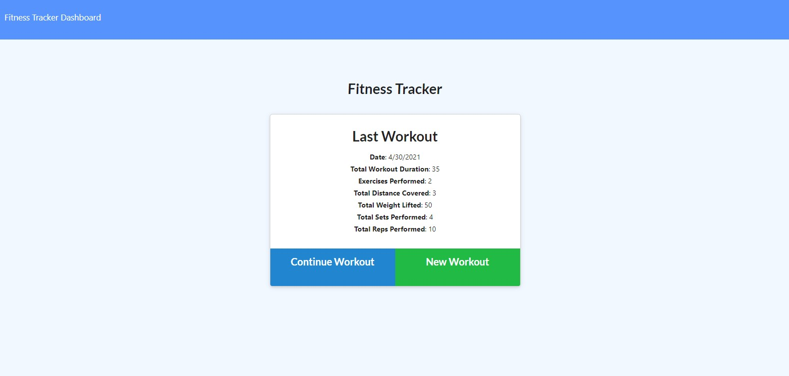
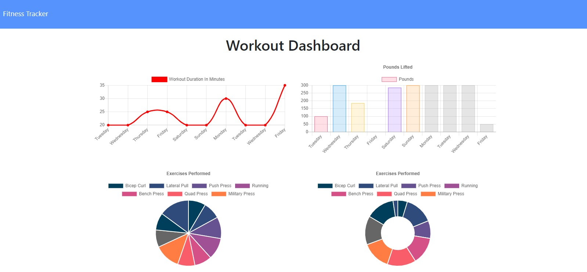

# Fitness-Tracker

## Description

A fitness tracker that allows users to add cardio or strength exercises and track the total distance of cardio and weight, reps, and sets as well as the total time spent exercising. Along with being able to intuitively add exercises, you can review stats and progress in the 'Dashboard' page over a few easy to read charts, dynamically created using the user's stats.

## Usage

On the homepage, users can choose to continue their previous workout or create a new one. All of the exercises they add will load onto the fitness tracker and continuously update the duration, weight, reps, sets, and distance with each add. 

On the dashboard, the left side shows a chart displaying the duration of exercise by day and a pie chart showing a breakdown of how muc time was spent on each exercise. On the right, users can see a bar graph of how many pounds they lifted each day.

## Links
[Deployed Heroku App](https://fast-springs-37663.herokuapp.com/)

[Github Repo](https://github.com/najuasaad/Fitness-Tracker)

## Screenshots

